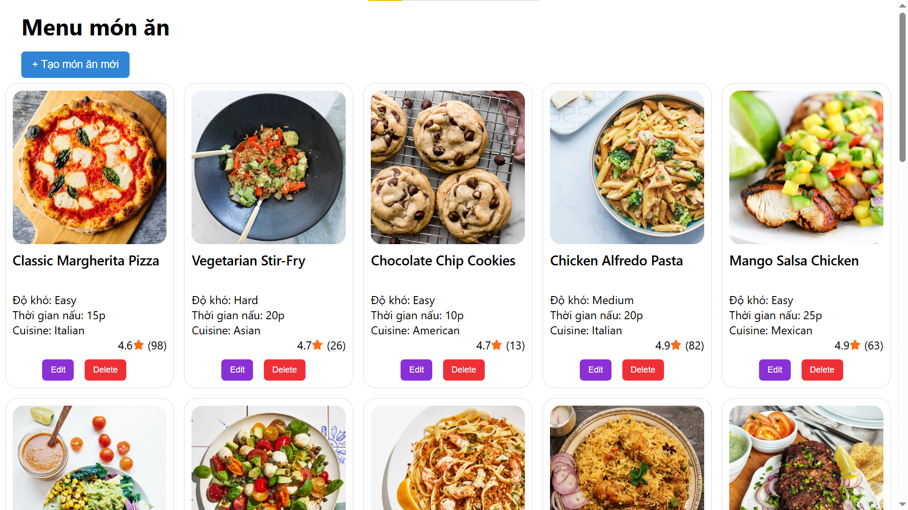

# Recipe-Share React web app

- This is a simple React web app, where I practice React hooks
- This web app shows Dishes and related information
- This web app also have some basic CRUD features: 
  + Add new dish
  + Delete dish
  + Update information of dish

## User Interface (UI)

## Getting starterd
After clone this repository, you can start this project by following steps:
1. Install dependencies:
  + `cd recipe-share` (if you’re not in the project directory)
  + `npm install`
2. Run json-server to get data:
  + `cd recipe-share` (if you’re not in the project directory)
  + `npx json-server –watch db.json –port 3001`
3. Run this React project (at another new terminal):
  + `cd recipe-share` (if you’re not in the project directory)
  + `npm start`

## Video demo
Open [this video](https://www.youtube.com/watch?v=KNbzDMZswbg) to view demo of this repository.

